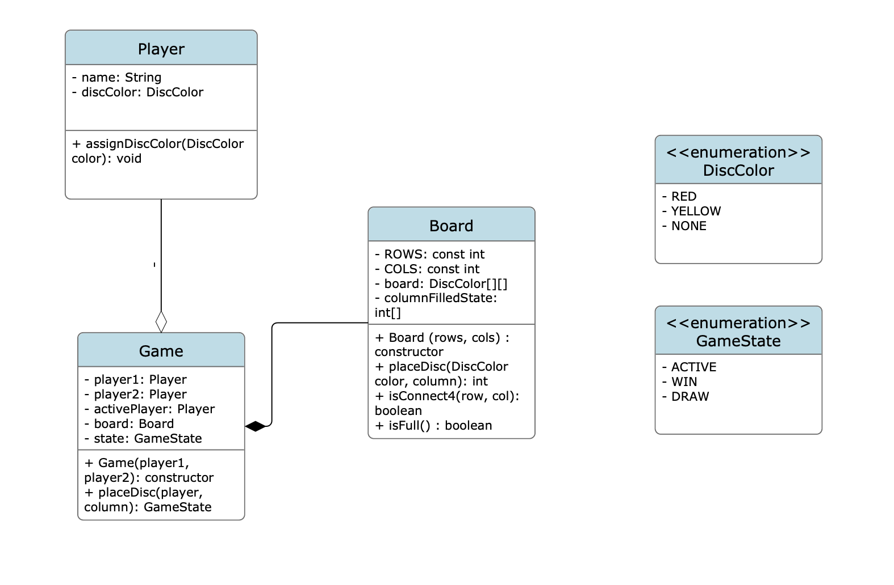

## PROBLEM STATEMENT
Design a connect 4 game.

### Requirements
1. Game is always played on a 6 * 7 board. (Will board size remain the same?)
2. Two players (Assigned colors - RED/YELLOW)
3. Game is played locally with the players alternating turns
4. Block invalid moves -> out of turn/out of board/full board.
5. Win conditions - horizontal, vertical, diagonal.
6. The player specifies the column in which the disk is dropped.

Out of Scope:
* Playing over a network
* UI rendering
* One game at a time (no multiple ongoing concurrent games)
* Saving state/undo
* AI player.

### Entities

Focus is on the nouns.
1. Game -> the orchestrator for the connect 4 game.
2. Board -> owns logic for placement & win/draw.
3. Player -> the players.

Enums:
1. DiscColor -> Red/Yellow/None
2. GameState -> Active/Draw/Win

Note that Move is not a valid class here since it's just a column placement. The board can manage it. (YAGNI)

### Class Diagram

