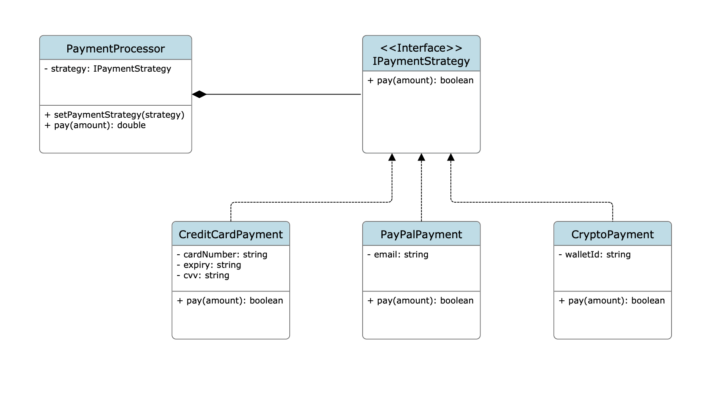

### Question:

We are building a payment processing system that supports multiple payment methods:
1. Credit card
2. PayPal
3. cryptocurrency.

Each method has a different processing flow, but the checkout service should not care which one is being used.

