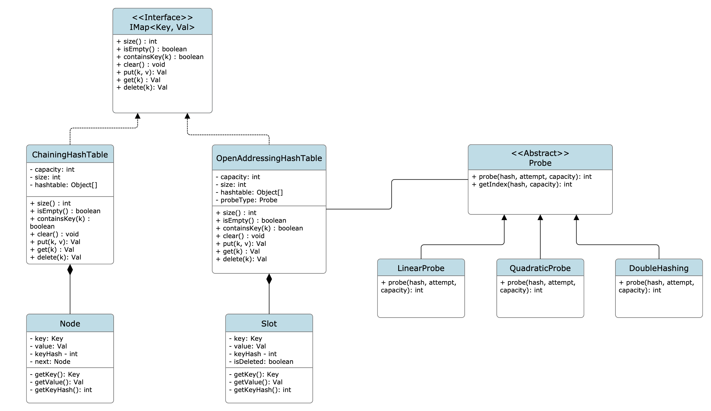
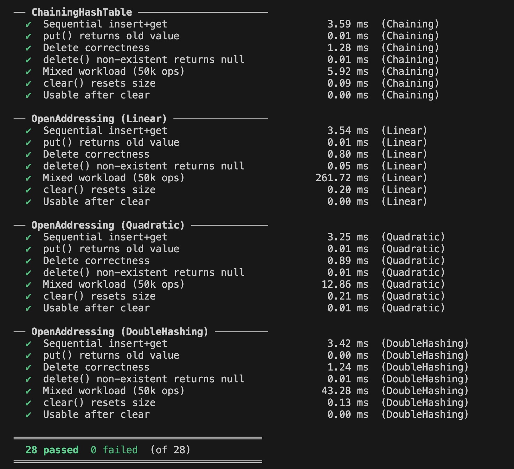

## In-Memory Key-Value Store (Hash Map)
Build a key-value store library to be shipped as an internal utility. 

Implement a generic HashMap<K, V> that supports standard operations with correct behaviour under collisions, resizing, and null handling.

Your implementation must work correctly for any key type that implements
1. equals() and
2. hashCode()
— not just strings or integers.

### Class Diagram

### Load Test Results

